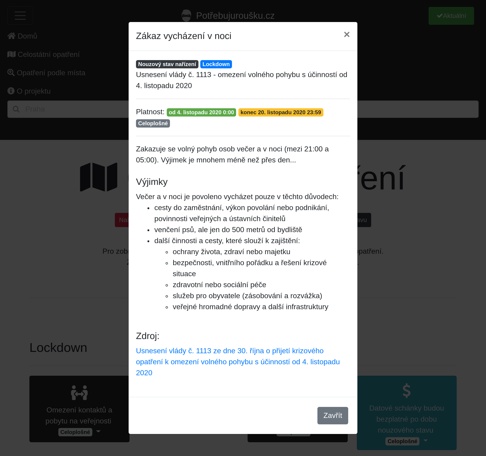
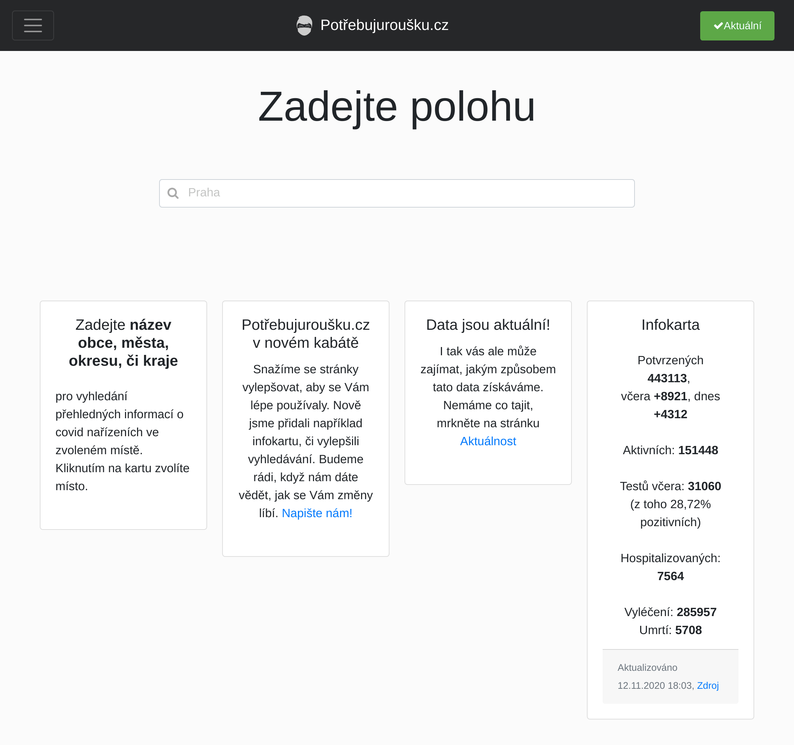
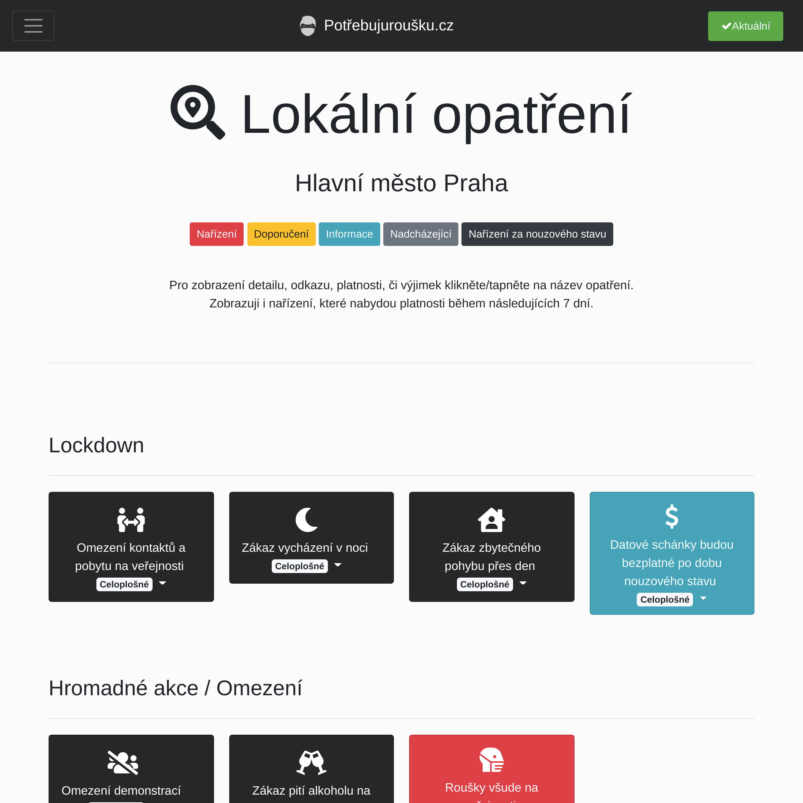
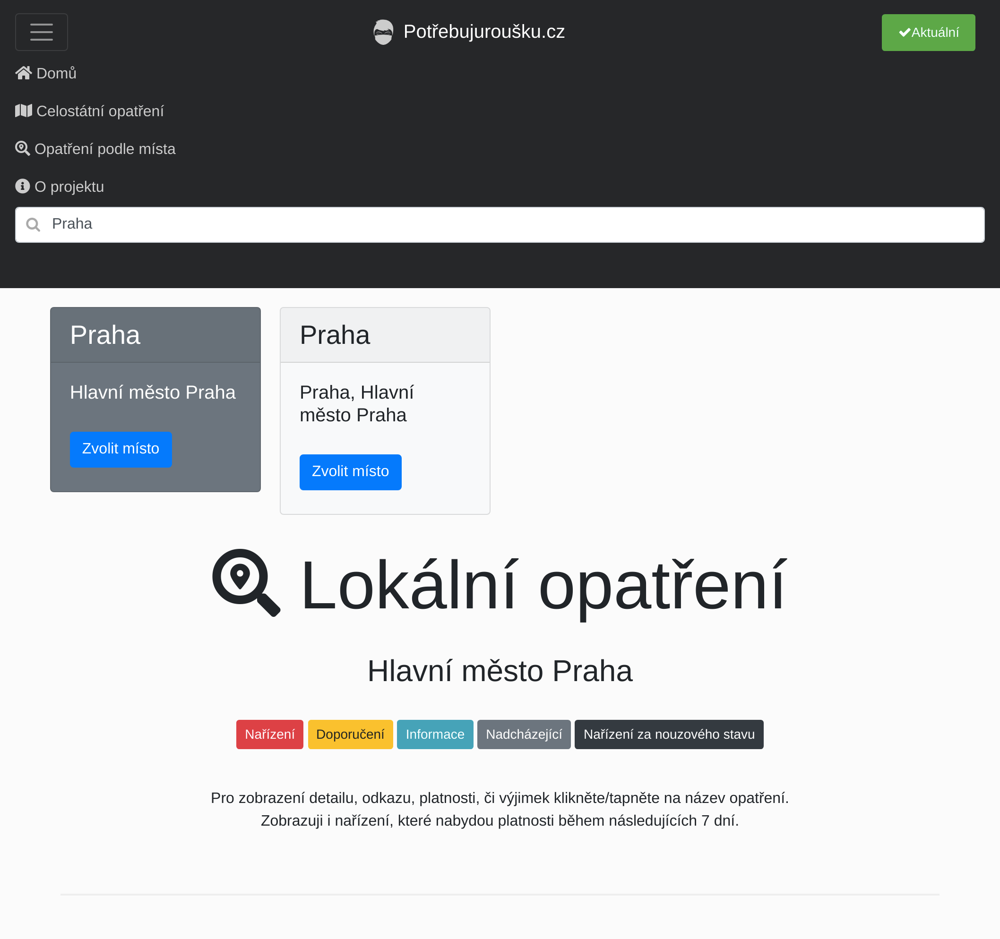
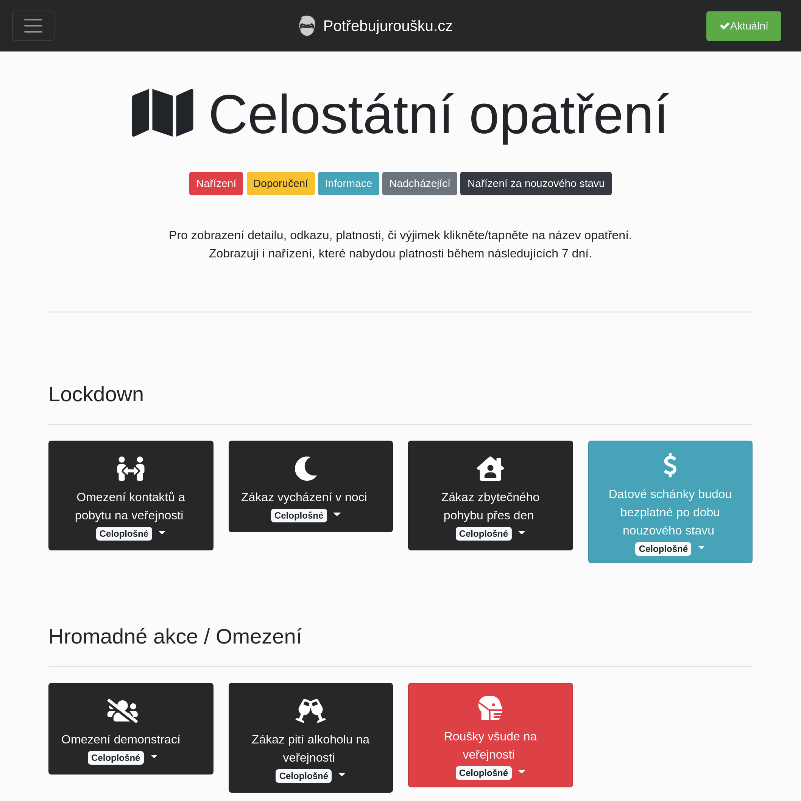
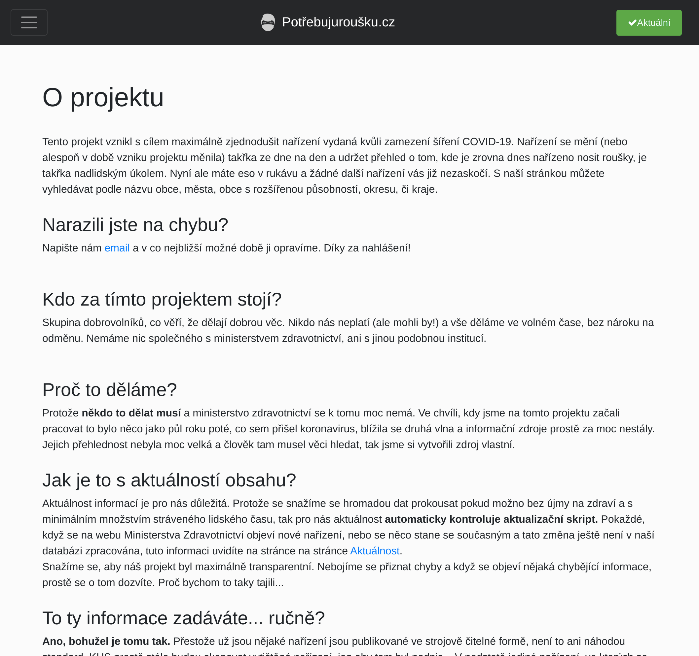

# Potrebujurousku.cz 

## Long time ago...

Back in the days when the COVID pandemic struck in 2020, there was a need for some sort
of website that would help summarize the chaotic regulations from ministries. This
project was alive for only a few months, and what you can see now is a tombstone of
something I put a bit of my heart into. Now I see all the imperfections, and I would
build it from scratch differently, but at least it was a very valuable lesson to me. I
would like to express my gratitude to anyone who contributed in any way to this project.
Thank you very much, and I am very happy that the whole pandemic thing is over now.

Below, you can find a bit of the backstory (CZ) of how everything happened and how
things worked, etc.

- 
- [GitHub repository of the report](https://github.com/tomas-dostal/potrebujurousku_streamlit)
- [Report (PDF)](https://github.com/tomas-dostal/potrebujurousku_streamlit/blob/main/potrebujurousku_report.pdf)

Here, you can find a few screenshots of how the site looked back then. Please keep in mind that none of the information in the screenshots or repository is up-to-date

|                             |                     |  |
|---------------------------------------------------------------------------------|--------------------------------------------------------------------------|----------------------------------------------------------------------------|
|  |  |       |

Peace! 
